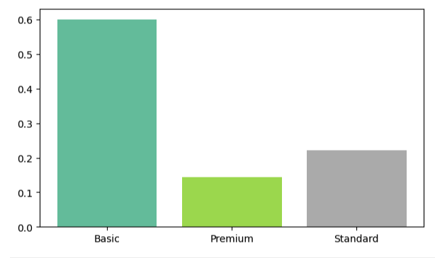
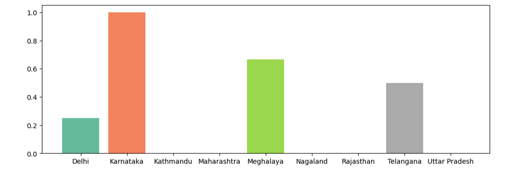

# 📊 Customer Churn Analysis

## 📌 Overview

This project performs an end-to-end customer churn analysis using SQL and Python. The objective is to identify customer churn patterns, calculate business KPIs, and recommend strategies to improve customer retention.

---

# 🛠 Tech Stack

- Python
- SQL (SQLite)
- Pandas
- NumPy
- Matplotlib
- Seaborn

---

# 📖 Churn Definition by Business

| Business | Churn Definition |
|-----------|------------------|
| SaaS | Subscription Cancelled |
| E-commerce | No Purchase in 90 Days |
| AdTech | No Activity for 90–120 Days |
| Streaming | Membership Inactive |
| Telecom | Account Terminated |
| Banking | No Transactions for X Months |

---

# 📂 Dataset

The project combines three relational tables.

- Customer
- Subscription
- Support

The tables are joined using CustomerID.

---

# 🔄 Workflow

- SQL Database Connection
- Data Import
- Data Cleaning
- Feature Engineering
- Exploratory Data Analysis
- Data Visualization
- Business Insights

---

# 📈 KPIs

| KPI | Formula |
|------|---------|
| Churn Rate | Churned Customers / Total Customers |
| Retention Rate | 1 − Churn Rate |
| ARPU | Revenue / Active Customers |
| Revenue at Risk | High Risk Customers |
| Customer Tenure | Subscription Duration |
| Churn by Plan | Group By Plan |
| Churn by State | Group By State |
| Escalation Rate | Escalations / Complaints |
| Avg Complaints | Complaints / Customers |

---

# 📊 Key Insights

- Overall Churn Rate: **28.6%**
- Retention Rate: **71.4%**
- Highest churn from Basic Plan
- Karnataka had the highest churn
- Peak churn during September 2024
- ARPU = ₹18.8
- Revenue Loss = 18%
- Monthly Plans churned much more than Annual Plans.

---

# 💡 Business Recommendations

- Improve retention for monthly subscribers.
- Investigate customer churn in Karnataka.
- Review pricing strategy for Basic Plan.
- Prioritize customers with high CLTV.
- Analyze competitor offerings.

---

# 🚀 Project Structure

```text
customer-churn-analysis

│

├── data

├── notebook

├── images

├── requirements.txt

└── README.md
```

---

# 📷 Visualizations

(Add screenshots here)

```markdown




```

---

# ⭐ Future Improvements

- Churn Prediction using Machine Learning
- Interactive Dashboard using Streamlit
- PostgreSQL Integration
- Power BI Dashboard
